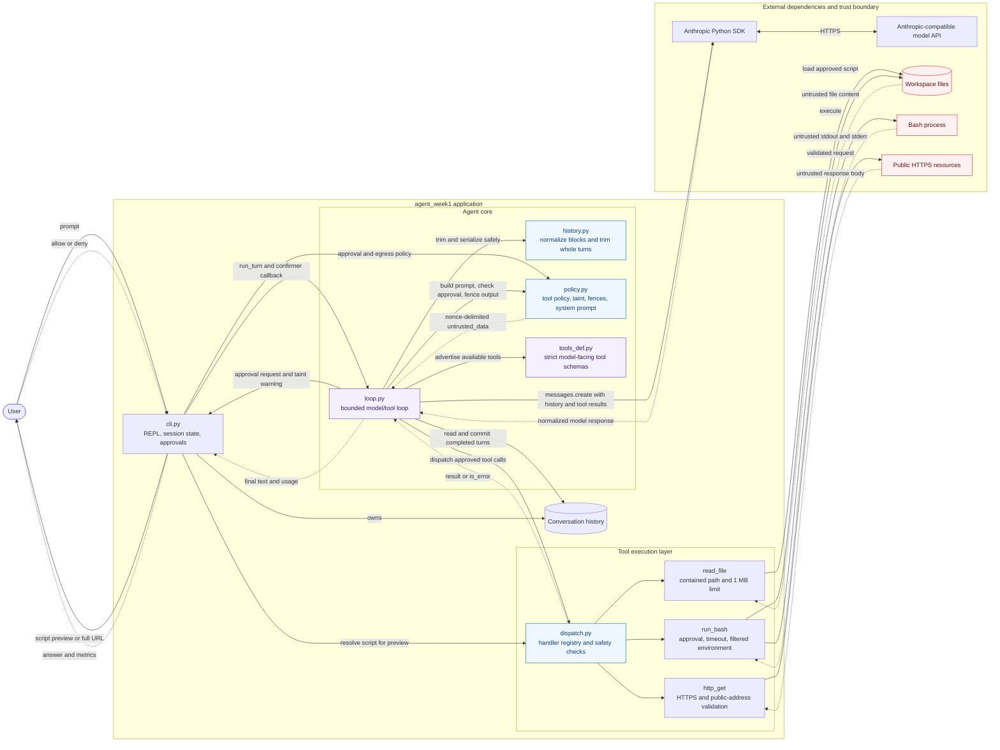

# Agent architecture

Arrows point from each component to the dependency or service it invokes.
Dashed arrows represent returned data. Red nodes are untrusted data sources or
side-effecting runtimes.

